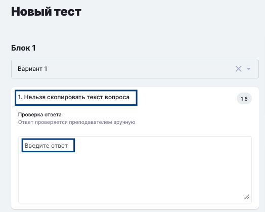

Для повышения честности при сдаче тестов и создания равных условий для всех сдающих в момент прохождения теста для сдающих:

1. Ограничена возможность копирования текста вопросов и ответов.

2. Недоступна вставка значений в поля "свободных" ответов, т.е. можно только напечатать ответ с клавиатуры.

{width=524px height=419px}

26\.08.2026