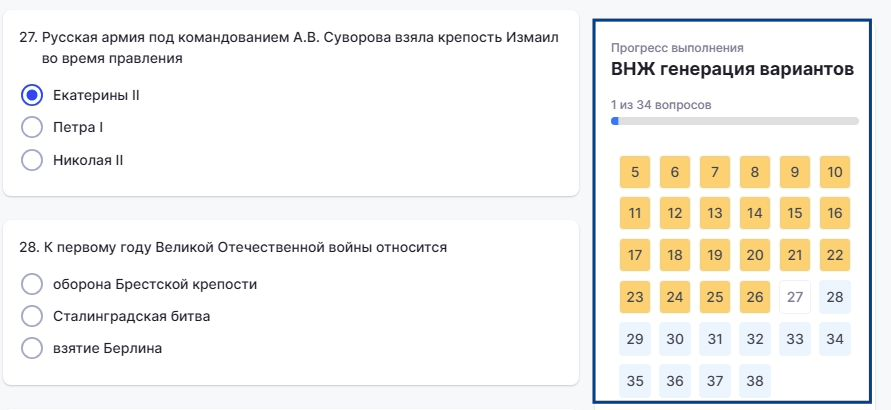
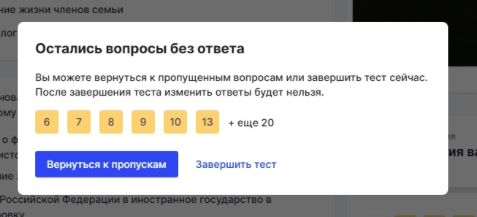

Если тест содержит >6 вопросов, то в боковой панели прогресс-бар будет отображаться следующим образом:

{width=891px height=410px}

-  Синим подсвечены те, на которые пользователь еще не дал ответ

-  Белым - те, на которые пользователь дал ответ

-  Желтым - пропущенные (вопрос считается пропущенным, если пользователь пропустил его и ответил на следующий. Например: пользователь ответил на вопрос 1, пропустил 2-й и ответил на 3-й. В момент ответа на 3-й вопрос 2-й автоматически фиксируется как пропущенный).

При попытке завершить тест с пропущенными вопросами, появится сообщение:

{width=477px height=217px}

Иконки с цифрами вопросов кликабельные, при нажатии пользователя на иконку (например, 32), произойдет возврат в тест к месту, где находится данный вопрос.

По нажатию на кнопку "Вернуться к пропускам» пользователь возвращается к первому пропущенному вопросу в тесте.

26\.08.2026