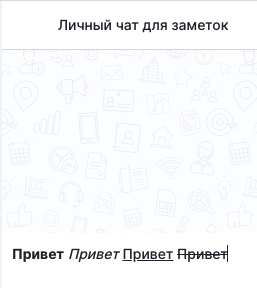

С целью повышения функциональности чатов реализованы базовые возможности по редактированию текста в чатах. Стили жирный/подчеркивание/курсив/зачеркивание теперь доступны на всех браузерах и ОС. Сочетания клавиш  стандартные для этих действий (Windows+Linux/MacOS):

-  **Жирный шрифт**: `Ctrl + B` / `Cmd + B`

-  **Курсив**: `Ctrl + I` / `Cmd + I`

-  **Подчеркивание**: `Ctrl + U` / `Cmd + U`

-  **Зачеркивание**: `Ctrl + Shift + X` / `Cmd + Shift + X`

{width=257px height=288px}

Также доступна вставка с форматированием на нашей стороне (только опции, указанные в п.1) и вставка без форматирования (`Ctrl + Shift + V` / `Cmd + Shift + V`).

03\.09.2026