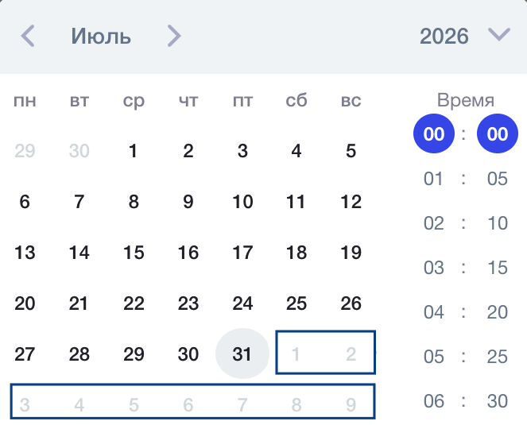

В программах, где указан проект Активные меры содействия занятости, при указании итогового дедлайна для активности и индивидуального срока сдачи решения невозможно выбрать дату, которая числится после даты окончания потока. Такие даты отображаются неактивными.

{width=663px height=535px}

26\.08.2026